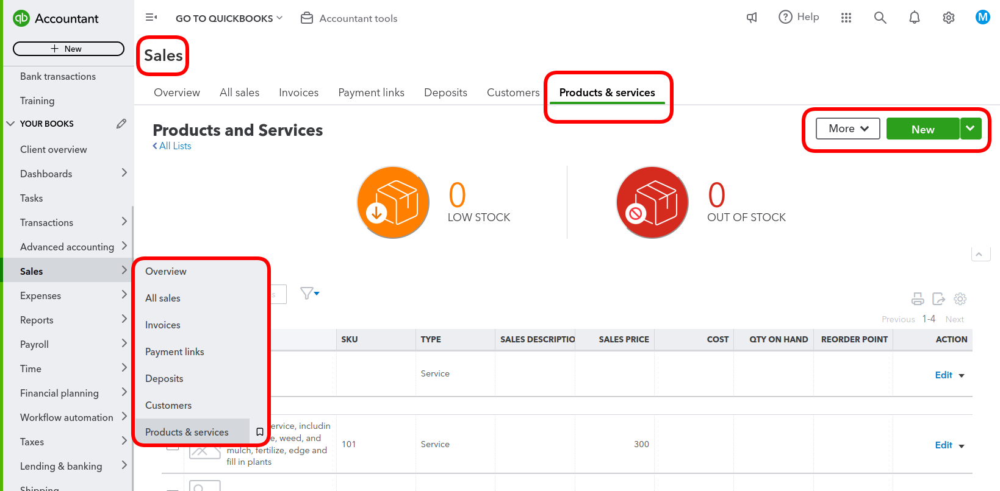
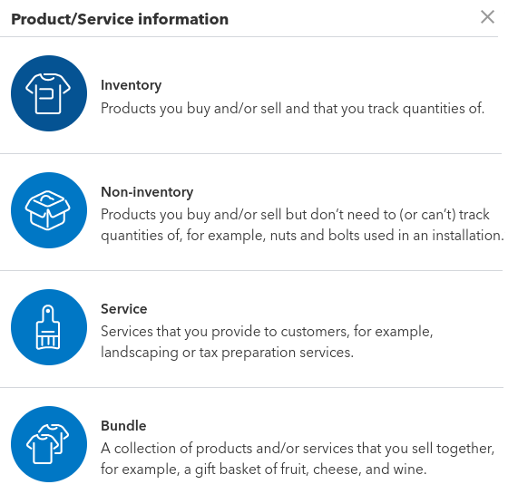
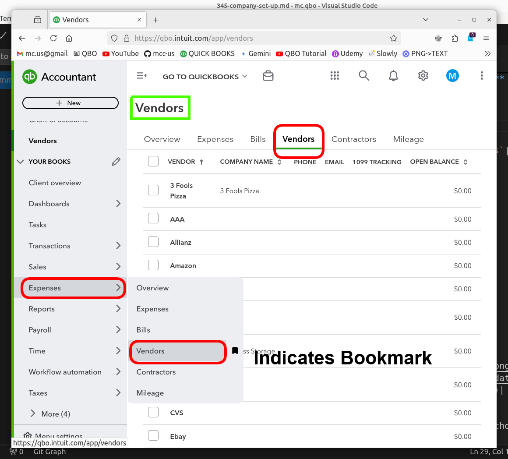
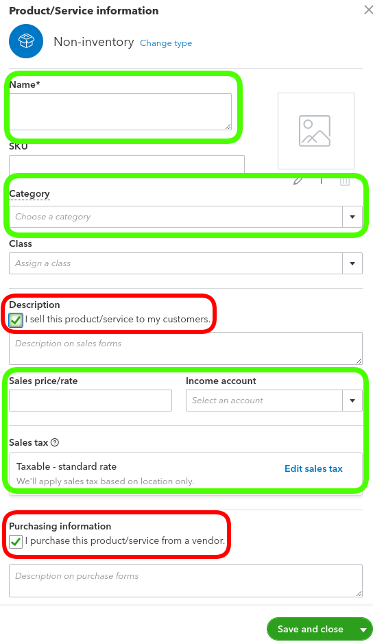
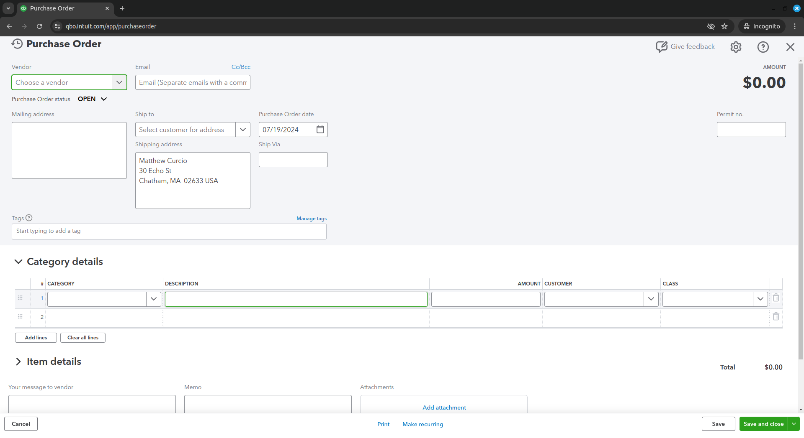
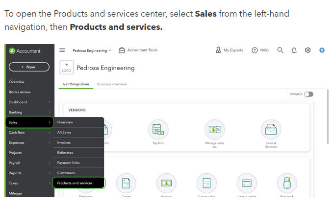

## 5 Products And Services

1. **Setting Up Products and Services**  
   1. Click `cog wheel` > `Lists` > `Products and Services`  
   2. Click the green button to start adding services.  
   3. Select `Service`, then enter the `Name`, `Sales price/rate`, and the associated `Income Account`  
   4. `Save and Close`  

2. **Reviewing and Managing Transactions**
   1. To view or edit transactions for a customer or vendor, click on their name, then choose `Transaction List` or `Customer/Vendor Details`  
   2. You can filter transactions and manage their details from this view  

 
   

 

